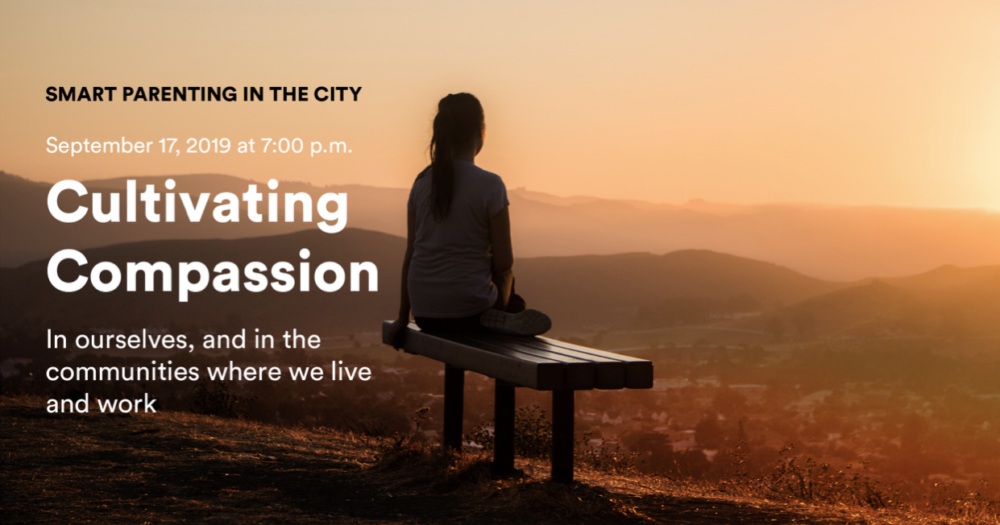

<h1>News and Events</h1>

Check here for ISEE institutes, retreats, workshops and downloadable fun! We provide transformational opportunities for k-12 educators, leaders, counsellors and parents to cultivate the assets of social connectedness through targeted applications of SEL principles. 

<a href="./event-cultivating-compassion.html"><h2>Cultivating Compassion</h2></a>
In ourselves, and the communities where we live and work

<a href="./event-cultivating-compassion.html">

</a>

<a href="./event-curious-not-furious.html"><h2>Curious Not Furious</h2></a>

<a href="./event-curious-not-furious.html">

</a>

<a href="./event-kindness-week.html"><h2>Kindness Week / Semaine de la Bienveillance</h2></a>

<a href="./event-kindness-week.html">

</a>

<a href="./event-smile-boomerang.html"><h2>Smile Boomerang / Epidemie des Sourires</h2></a>

<a href="./event-smile-boomerang.html">

</a>

