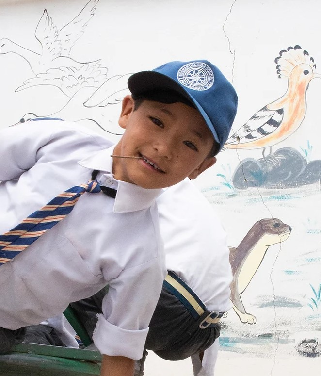
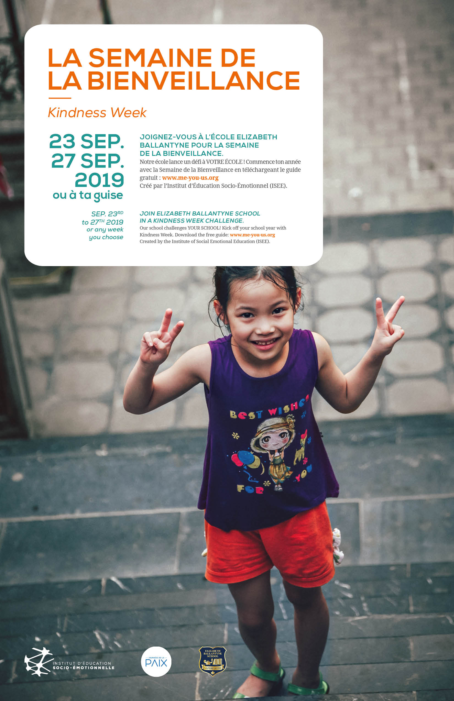
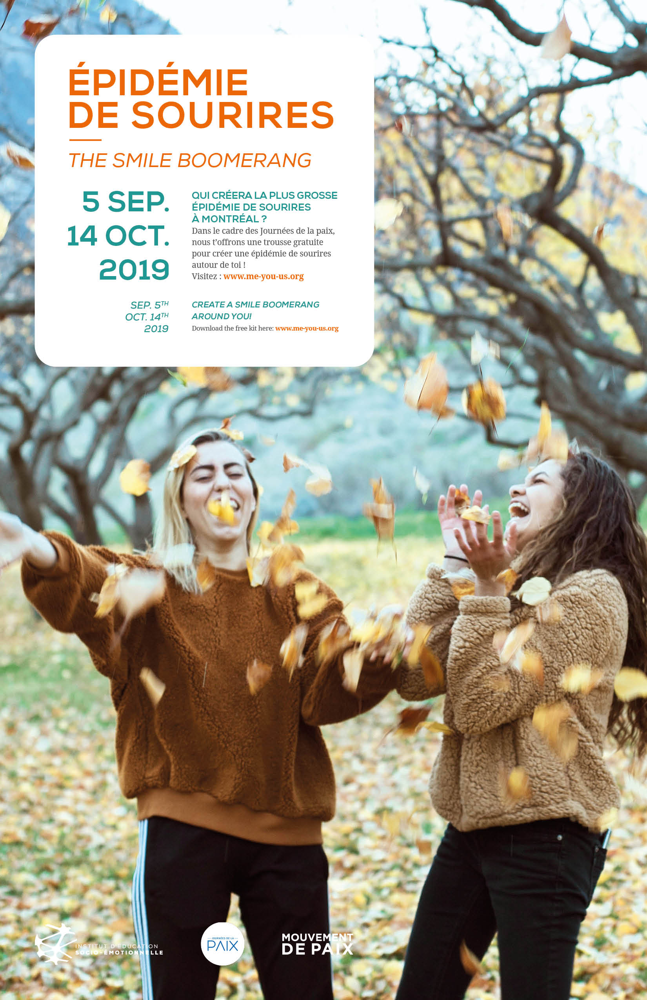

<h1>News and Events</h1>

<!-- 

Check here for ISEE institutes, retreats, workshops and downloadable fun! We provide transformational opportunities for k-12 educators, leaders, counsellors and parents to cultivate the assets of social connectedness through targeted applications of SEL principles. 

 -->
<!-- 

<h2>1. Cultivating Compassion</h2>
In ourselves, and the communities where we live and work

 -->

<h3>1. A Weatherhead East Asian Institute & Columbia University Event </h3>
New approaches in Himalayan Education: Learning in Ladakh

25-28 April 2023
Panelist: Sophie Langri
<a href="https://www.newhimalayaned.org/ ">newhimalayaned.org</a>

<!-- 

 -->
<!-- 
Join us in Montreal September 17, 2019 at Trafalgar School for the first lecture in the 2019-20 Smart Parenting series. This series is open to the public.   What is compassion and how do we cultivate it in ourselves, and in the communities where we live and work? Join us to learn some strategies that you can begin to use immediately. When you choose to practice compassion—not just talk about it and think about it but actually commit to it—your relationship with yourself and others will change, your anxiety and depression will decrease, and you will simply feel better. This public lecture will be lead by Dr. Tara V. Wilkie, Ph.D, psychologist and co-founder of the Institute of Social Emotional Education.  To register contact : Kelly Carrier at <a href="mailto:kcarrier@trafalgar.qc.ca">kcarrier@trafalgar.qc.ca</a>. -->
<!-- 

<h2>2. Curious Not Furious</h2>

 -->

<!-- For more information contact <a href="mailto:taravwilkie@gmail.com">Tara Wilkie</a>.

<h2>3. Kindness Week / Semaine de la Bienveillance</h2>

<a href="./static/events/iese-kindnessweek-presentation-EN.pdf">Download Kit-English</a>

<a href="./static/events/iese-kindnessweek-presentation-FR.pdf">Download Kit-French</a> -->

<!-- 

<h2>4. Smile Boomerang / Epidemie des Sourires</h2>

<a href="./static/events/iese-smileboomerang-presentation-EN.pdf">Download Kit-English</a>

<a href="./static/events/iese-smileboomerang-presentation-FR.pdf">Download Kit-French</a>

<a href="./static/events/iese-smileboomerang-carte.pdf">Download Cards-Bilingual</a> -->
