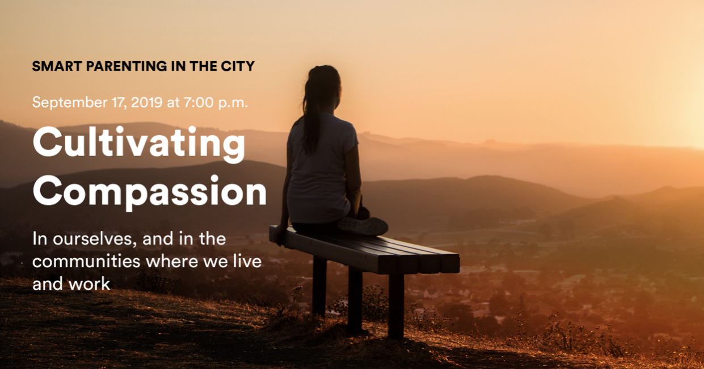
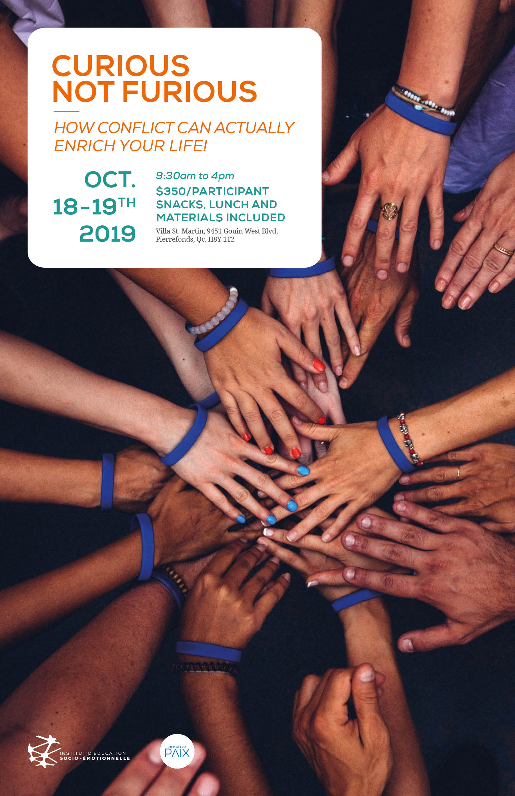
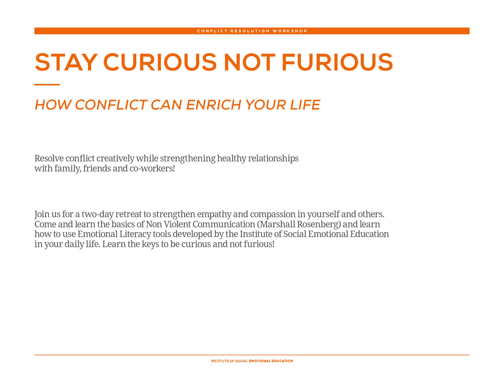
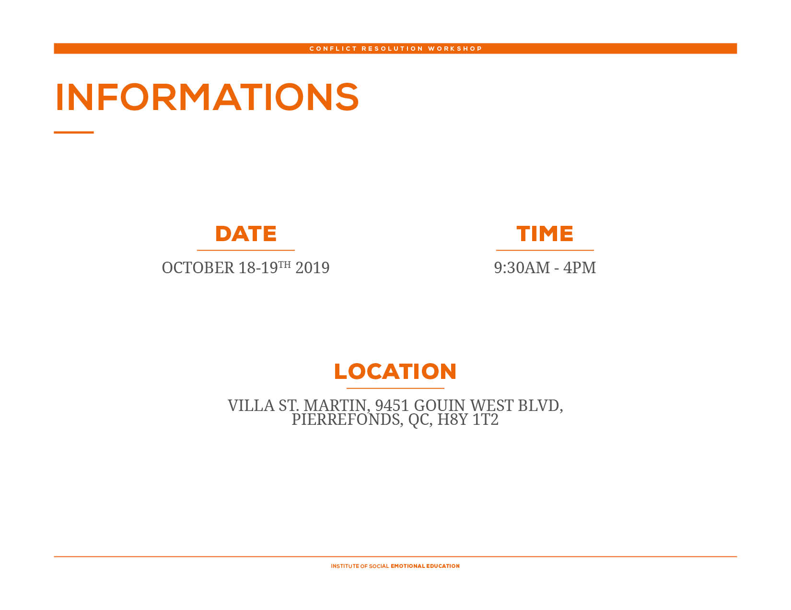
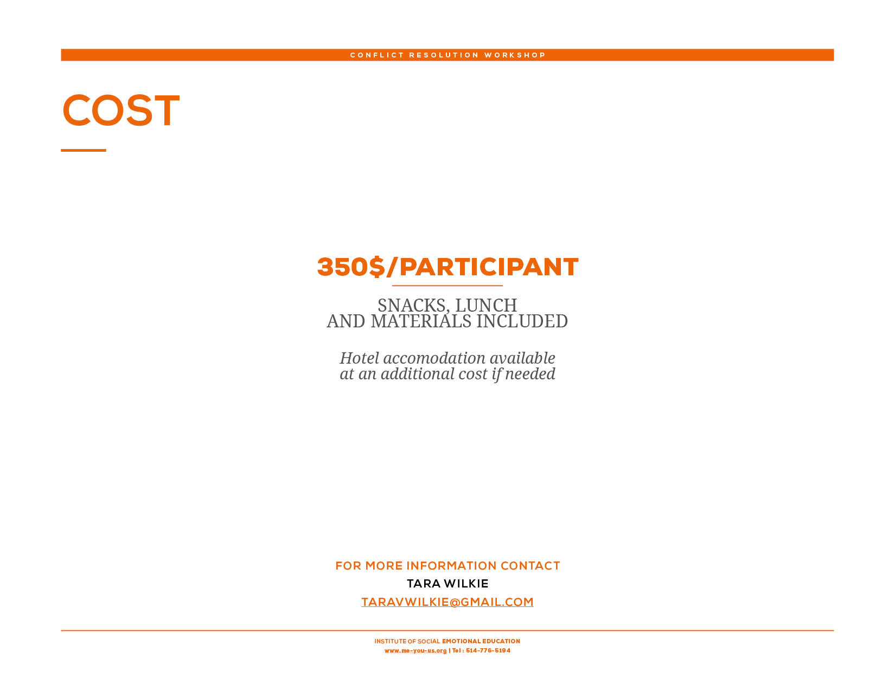

<h1>News and Events</h1>

Check here for ISEE institutes, retreats, workshops and downloadable fun! We provide transformational opportunities for k-12 educators, leaders, counsellors and parents to cultivate the assets of social connectedness through targeted applications of SEL principles. 

Join us in Montreal <b>September 17, 2019</b> at Trafalgar School for the first lecture in the 2019-20 Smart Parenting series. This series is open to the public.

<h2>Cultivating Compassion</h2>
In ourselves, and the communities where we live and work

What is compassion and how do we cultivate it in ourselves, and in the communities where we live and work? Join us to learn some strategies that you can begin to use immediately. When you choose to practice compassion—not just talk about it and think about it but actually commit to it—your relationship with yourself and others will change, your anxiety and depression will decrease, and you will simply feel better. This public lecture will be lead by Dr. Tara V. Wilkie, Ph.D, psychologist and co-founder of the Institute of Social Emotional Education.

<h2>Curious Not Furious</h2>

More information about the two-day workshop.

To register contact : Kelly Carrier at <a href="mailto:kcarrier@trafalgar.qc.ca">kcarrier@trafalgar.qc.ca</a>.

<h2>Kindness Week/Semaine de la Bienveillance</h2>

<a href="./static/events/iese-kindnessweek-affiche-11x17.jpg">Download poster</a>

<a href="./static/events/iese-kindnessweek-presentation-EN.pdf">Download presentation in English</a>

<a href="./static/events/iese-kindnessweek-presentation-FR.pdf">Télécharger la présentation en Français</a>

<h2>Smile Boomerang/Epidemie des Sourires</h2>

<a href="./static/events/iese-smile_boomerang-affiche-11x17-v3.jpg">Download poster</a>

<a href="./static/events/iese-smileboomerang-carte.pdf">Download cards</a>

<a href="./static/events/iese-smileboomerang-presentation-EN.pdf">Download presentation in English</a>

<a href="./static/events/iese-smileboomerang-presentation-FR.pdf">Télécharger la présentation en Français</a>
