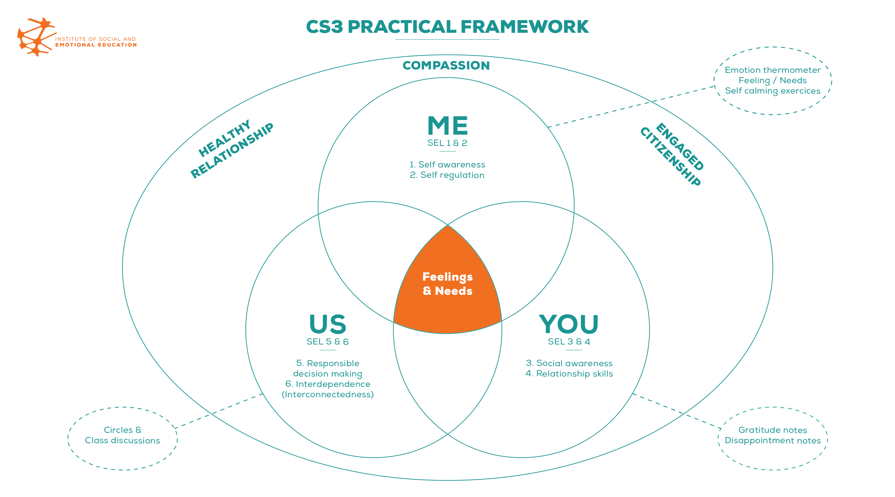

<!-- 

Institute of Social and Emotional Education

<h2>Better understanding. 
Better learning. Better living.</h2>

Empathy, Compassion, Gratitude, & Interconnectedness leads to... Healthy Relationships,
Engaged Citizenship and Embracing Shared Common Humanity

 -->

<h2>Our mission</h2>

ISEE is dedicated to bringing the insights and techniques of Social and Emotional Learning (SEL) to key sectors of our society - our schools, families, communities and the workplace in order to foster healthy relationships.  We use the well researched and validated SEL framework - self-awareness, self-management, social awareness, relationship skill and responsible decision making - and have expanded it to include a 6th component - interconnectedness / interdependence - in order to facilitate the explicit teaching of compassion, interconnectedness, cooperative learning, conflict resolution and ethics.  

<h2>Our vision</h2>

Our theoretical framework is organized in 3 domains of <b>ME</b>, <b>YOU</b> and <b>US</b>.  At the core of our practical framework is the acquisition of a literacy of feelings and needs and its application in each of the 3 domains.  This model helps us teach and develop in a non-linear way, fundamental human skills and values. By bringing forward and teaching in a clear and efficient way these fundamental human skills, this model brings in a new consciousness in not only the individual, but also the communities, and ensures effective change such as healthier relationships and compassionate climate in schools, families, and the workplace.  

  

<!-- 

<h3>ME Domain :</h3>

It is because we care for our own needs that we have the capacity to appreciate other's kindness and love

Dalai Lama

<h3>YOU Domain:</h3>

I have learned that people will forget what you said, people will forget what you did, but people will never forget how you made them feel.

Maya Angelou

<h3>US Domain:</h3>

We cannot solve our problems with the same thinking we used when we created them.

Albert Einstein

 -->
